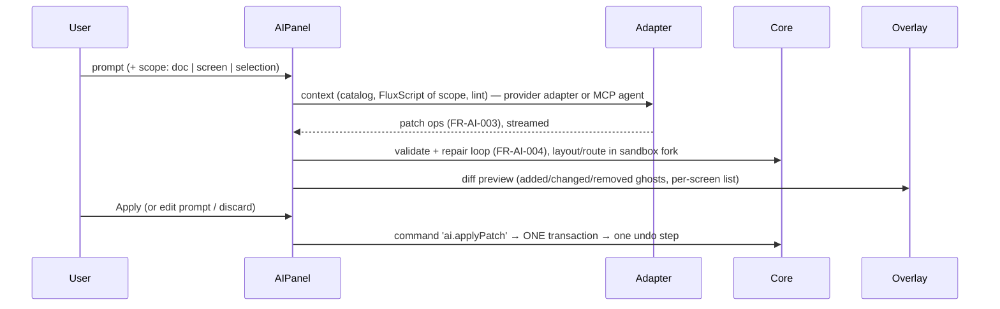

# 04 — Rendering & Editor (`@fluxion/render`, `@fluxion/editor`, `apps/studio`)

> Read when: touching `<ScreenView>`, an element view, theming in rendered content, measurement,
> culling, the edit overlay, a tool, snapping, the inspector, clipboard, the AI panel, the studio
> shell, or anything that affects edit/present parity or drag performance.
> Research basis: `research/01` §2 (layering, camera, culling), §3.4 (tools), §4.4 (text), §5.3
> (decorations), §7.3 (key decisions); `research/03` §8.1 (frame rules). Requirements: `15-editor.md`,
> FR-CMP-*, NFR-PERF-001/002/006, NFR-SIZE-001/002.

## 1. Responsibilities

| Package | Owns | Never does |
|---|---|---|
| `render` (L3) | Drawing one screen from store signals + an optional animation state; element view registry; CSS variables from theme; text measurement adapter; culling | Handle pointer gestures, mutate the store, own time |
| `editor` (L4) | Overlay chrome, tools FSM, hit-testing, snapping, camera, inspector, panels, palette, keymap, clipboard, AI panel, animation preview (via `player`) | Draw content (it mounts `<ScreenView>`); import `player` internals beyond its public API |
| `apps/studio` | Routing, file open/save, PWA, autosave, provider adapters, wiring registries & packs | Business logic (lives in packages) |

## 2. `@fluxion/render`

### 2.1 Layer stack and the hybrid decision

```
<div class="fx-screen" style="--fx-*: …">          ← CSS vars from theme; fit/camera transform
 ├─ layer: background   CSS/SVG (fills, gradients, images, master-screen elements)
 ├─ layer: content      one positioned wrapper per element, stacked by fractional index
 │    ├─ .fx-el[data-el-id] (shape)      <svg> outline+decorations │ <div> rich text regions
 │    ├─ .fx-el (connector)              <svg> path+markers+hops   │ <div> HTML labels
 │    ├─ .fx-el (component)              <div> React component (error boundary)
 │    └─ .fx-el (group/frame)            <div> clip container, children nested
 ├─ layer: riders       <canvas> (pointer-events:none), used above the DOM-rider threshold (07 §4.3)
 ├─ layer: overlays     popups/popovers/<dialog> roots, presenter ink & laser (player)
 └─ slot:  editOverlay  editor-supplied SVG in screen coordinates (absent in present/export)
```

**Decision: absolutely-positioned DOM wrappers, each with its own small `<svg>`; no
`foreignObject` in the live renderer.** Rationale:

- *Z-order interleaving*: shapes and connectors mix freely in one stacking context ordered by
  fractional index (tldraw model, research 01 §2.2). A single connector SVG would force z-bands.
- *Text & components*: rich text and React components sit in real HTML — browser line breaking,
  bidi, selection, contentEditable, a11y — without `foreignObject`'s known issues (Safari
  transform/filter bugs, clipping, rasterization).
- *Compositing*: each wrapper is promotable, so WAAPI can animate `transform`/`opacity` on the
  compositor (research 03 §8.1 rule 1). An SVG `<g>` would animate on the main thread.
- *Export*: the SVG exporter (FR-EXP-004) serializes each wrapper into a nested `<svg>` and turns
  text regions into `<foreignObject>` or outlined `<text>` (with the Node measurer). The
  `foreignObject` path lives **only** in the export serializer.

The cost is one DOM subtree per element. At the target scale (hundreds to ~2k elements,
NFR-PERF-002) memoized views plus culling keep that within budget (§5).

### 2.2 Public API

```ts
type RenderMode = 'edit' | 'present' | 'export' | 'thumbnail';

interface ScreenViewProps {
  store: Store; screenId: RecordId; mode: RenderMode;
  view: { kind: 'fit'; box: Box } | { kind: 'camera'; camera: Camera };  // camera = {x,y,z}
  breakpoint?: string;                   // applies element.overrides[bp] (FR-RSP-003)
  animState?: Signal<AnimState>;         // from @fluxion/anim; structure-level (visibility, variants)
  handles?: ElementHandleSink;           // player/editor get refs for per-frame direct writes
  editOverlay?: ReactNode;               // editor only
  cull?: boolean;                        // default: true for camera views
}

interface ElementHandle {                // per-frame writes bypass React (research 03 §8.1 rule 10)
  id: RecordId; root: HTMLElement; geometry?: SVGGraphicsElement;
  setStyleVar(name: string, value: string): void;   // e.g. --fx-anim-opacity
  setAttr(target: 'path' | 'stroke', name: string, value: string): void;
}

interface ElementView<E extends ElementRecord = ElementRecord> {
  kind: E['kind'] | `${string}:${string}`;
  Component: React.ComponentType<ElementViewProps<E>>;   // must be pure: (record, resolved, mode) → UI
  measure?(el: E, m: TextMeasurer): Size | undefined;  // intrinsic size for autoSize/layout
  a11y(el: E): { role?: string; label?: string; hidden?: boolean };
  exportSvg?(el: E, ctx: ExportCtx): string;           // default: DOM → SVG serializer
  cull: 'hide' | 'unmount' | 'never';                  // components default 'hide' (keep state)
}
```

`elementViews` and `components` are render-level registries (03 §4). Packs register views, the
same way third parties do; an unknown kind renders a placeholder that keeps its record (FR-DOC-005,
FR-EXT-008). Component views receive the FR-CMP-002 contract (`props`, tokens, `mode`, step,
variables, `emit`) and are wrapped in an error boundary (FR-CMP-007, NFR-REL-004).

### 2.3 Styling

- `theme` emits a flat CSS-variable map (`--fx-color-primary`, `--fx-font-body`, …) onto
  `.fx-screen`. Per-screen theme overrides re-emit on that screen only (FR-THM-004).
- Views read **resolved styles**: `theme`'s `resolveStyle` (resolution order in 02 §2), wrapped
  per element in a core `computed` by `render` (core may not import theme; ADR-0015). Token refs
  become `var(--fx-…)`, so a theme switch restyles without re-rendering views.
- Content CSS: strings of `fx-`-prefixed rules in `@layer fx.content` (render's content CSS plus
  each registered view's `css`), inlined by SSR and injected once in the browser (ADR-0015);
  Tailwind never reaches content (ADR-0010). Identical CSS in all modes is a precondition for parity.

### 2.4 Measurement

`TextMeasurer` port (03 §7). The browser implementation measures with canvas/Pretext first and
verifies with a batched DOM read in a hidden measuring root, only for `autoSize` text and
shrink-to-fit. It waits for `document.fonts.ready` and caches by `(text hash, fontKey, maxWidth)`.
Results are derived data (a signal cache), never written to records except when a command bakes
a size (e.g., grow-shape). Component views may report size and dynamic anchors through
`useFluxion().reportAnchors()` (FR-ANC-008).

### 2.5 Culling & spatial index

A per-screen `SpatialIndex` (03 §6) is kept by `core`: `rbush` while editing, and `flatbush`
built once for player/export. `<ScreenView>` queries the visible page box (camera box plus a
margin) each frame when the camera changes. Out-of-view wrappers get `content-visibility:hidden`
(`cull:'hide'`) or unmount (`'unmount'`). Fit views that show the whole screen skip culling.

### 2.6 One renderer, two modes: parity

Mode differences are an allow-list, enforced by a lint rule that permits reading `mode` only in
`render/src/mode-policy.ts`:

| Concern | edit | present |
|---|---|---|
| Component pointer events | captured by editor unless entered/`interactiveInEdit` | live |
| Build-hidden elements | final state by default; preview toggle uses `animState` (FR-ANI-011) | `animState` |
| Comments, hidden-layer ghosts | editor overlay only | absent |
| Focus/tab order, ARIA live region | off | on (NFR-A11Y-002) |

**Parity tests (FR-EDT-010):** a Playwright fixture set renders each screen at a given
`(step, t)` in edit mode (empty selection, overlay slot unmounted) and in present mode. Two checks:
(1) the serialized DOM of the `content` layer is equal after stripping an attribute allow-list,
and (2) the pixel diff is ≤ 0.1 %. Any failure blocks the gate.

## 3. `@fluxion/editor`

### 3.1 Event pipeline

```
pointer/keyboard/wheel (one listener per type on the viewport)
   │ normalize: PointerInfo {screenPt, pagePt = camera⁻¹(screenPt), buttons, mods, pressure}
   ▼
hit-test: overlay handles first (screen space) → rbush candidates near pagePt
          → geometry test per candidate (outline, stroke tolerance ∝ 1/zoom, z-order)
   ▼
tool FSM (current state node) ── emits ──▶ commands (core) ──▶ store.transact(mergeKey)
   │                                                   │ diff
   └── session store (Zustand): hover, selection, camera, snap guides ◀──┘ render + overlay
```

Hit-testing uses geometry, not `elementFromPoint`, so rotated shapes, thin strokes and hollow
shapes work (research 01 §2.3). Components hit-test as their bounds.

### 3.2 Tools: hand-rolled statecharts

```ts
interface StateNode {
  id: string; children?: Record<string, StateNode>; initial?: string;
  onEnter?(ctx: ToolCtx, info?: unknown): void; onExit?(ctx: ToolCtx): void;
  onPointerDown?(ctx: ToolCtx, e: PointerInfo): Transition | void;
  onPointerMove?(ctx: ToolCtx, e: PointerInfo): Transition | void;
  onPointerUp?(ctx: ToolCtx, e: PointerInfo): Transition | void;
  onKeyDown?(ctx: ToolCtx, e: KeyInfo): Transition | void;
  onCancel?(ctx: ToolCtx): Transition | void;           // Esc, pointercancel, blur
}
type Transition = { to: string; info?: unknown };
```

`select` = `idle → pointing → {translating | brushing | resizing | rotating | dragging_handle |
editing_text | entered_component}`. `connector` = `idle → pointing → creating → (snapping to
anchor)`. There are also `hand`, `shape`, `text`, `frame`, `pen`, `freehand` and `image`
(FR-EDT-003). Tools are registered in the `tools` registry. XState is avoided on the hot path;
modal flows such as AI sessions may use plain reducers.

### 3.3 Overlay, camera, snapping

- **Overlay** is one SVG in screen coordinates on top of `<ScreenView>`. It draws selection
  bounds, 8 resize handles and a rotate handle, connector endpoint/segment/waypoint handles, anchor
  dots on hover (FR-ANC-006), smart guides with distance labels, the marquee, drop targets and the
  AI diff ghosts. Handle size stays constant because they sit outside the scaled content. If it
  profiles hot, it moves to Canvas2D behind the same API.
- **Camera** `{x, y, z}` lives in the session store, with z from 0.05 to 32 (FR-EDT-002). One CSS
  transform on the content container. Present mode uses a fit transform.
- **Snapping engine** (FR-ARR-005): pure, and unit-tested without the DOM.

```ts
interface SnapQuery { moving: Box[]; kind: 'move' | 'resize' | 'endpoint'; zoom: number; disabled: boolean }
interface SnapResult { delta: Vec2; guides: Guide[]; anchor?: { elementId: RecordId; anchor: AnchorRef } }
interface SnapProvider { id: string; candidates(q: SnapQuery, idx: SpatialIndex): SnapCandidate[] }
// built-in providers: grid, edges/centers, equal-gaps, screen safe-area, anchors, rotation steps
```

The threshold is `8px / zoom`. Candidates come from rbush in the moving box plus the threshold.
The lowest-distance candidate wins per axis, and Alt bypasses snapping.

### 3.4 Inspector, panels, palette, keymap

- **Inspector generated from schemas** (FR-EDT-008). Zod schemas in `schema` carry UI metadata via
  `.meta({ ui: 'token-color' | 'slider' | 'enum-icons' | …, group, order })`. A generator walks
  the schema and renders field widgets. For multi-selection it intersects fields and shows a
  mixed state, and applying a value writes all selected in one command. Plugins register
  `inspectors` to replace or extend sections for their kinds, and plugin `props` schemas get
  generated UI for free.
- **Panels** (screens, library, layers, timeline, interactions, validation, source, AI) register
  in `panels` with slot and order. Layout persists per user (FR-EDT-001).
- **Command palette** lists every `commands` entry whose `when` passes (FR-EDT-011).
  **Keymap** = `{ key: 'mod+shift+l', command: 'element.align', args?, when? }[]`. Defaults come
  from packs and user overrides from local settings (FR-EDT-012). The `?` key opens the
  generated cheat sheet.

### 3.5 Clipboard (FR-EDT-007)

```ts
interface ClipboardPayload {
  fluxion: '1'; schemaVersion: string; sourceDocId: string;
  records: AnyRecord[];                  // elements + internal bindings + referenced step anims (opt.)
  assets: { hash: string; mime: string; dataUrl?: string }[];  // inline if ≤ 1 MB, else by hash
  themeTokens?: Record<string, string>;  // resolved fallbacks for cross-doc paste
  bounds: Box;
}
```

On copy the editor writes several representations: `web application/x-fluxion+json` (async
Clipboard API custom format), `text/html` (rendered SVG plus the payload in
`<template data-fluxion>`), `text/plain` (labels as an outline, or FluxScript for a whole screen),
and `image/png` (rasterized selection). Paste tries them in that order. It then remaps IDs
through the `Random` port, keeps bindings whose both ends were copied, turns the others into free
endpoints, and offsets by +16 px per repeated paste. System paste also accepts SVG (sanitized,
NFR-SEC-001), images (asset + image element), and Mermaid or Markdown text (importers,
FR-IMP-001/002).

### 3.6 Component elements in edit mode (FR-CMP-004)

The component wrapper gets `pointer-events:none` and `inert` unless
`session.enteredId === id` (entered by double-click or Enter) or the kind declares
`interactiveInEdit`. When entered, the overlay shows an "editing component" frame, and Esc or a
click outside exits. Component state that must persist goes through commands on `props`
(FR-CMP-005).

### 3.7 AI panel (FR-EDT-014)



The preview runs on a copy-on-write **store fork** (`store.fork()`: reads fall through, writes
are local). The main document stays untouched until Apply. The fork's diff drives the ghost
overlay and a textual change list.

### 3.8 Animation preview (FR-ANI-011, FR-EDT-009)

The editor creates a `player` `PresentationController` bound to the same store with a
**controlled clock** (07 §4.8). The timeline panel's scrubber calls `seek({step, t})`, "Play
step" runs the clock, and the result flows into `<ScreenView animState handles>`. The editor
shows the final state by default. Present in place (F5) swaps the root tool set to the player
input layer and puts the store in read-only mode (a policy guard rejects commands, FR-PRS-004).

## 4. Studio app shell

- **Routes**: `/` (library, recents), `/edit/:docId`, `/present/:docId#/screen/step`,
  `/open?src=<url>`. Speaker view is `/present/:docId?view=speaker`.
- **File handling** (FR-FIL-006..008): File System Access API with a download fallback. The PWA
  manifest `file_handlers` plus `launchQueue` open `.flux` and `.flux.html` files.
  Drag-and-drop, paste, and `?src=` also work. Autosave goes to OPFS/IndexedDB via the `FileIO`
  port every ≤ 5 s with atomic swap and last-N snapshots (NFR-REL-001).
- **PWA**: a precaching service worker for the app shell, packs and fonts. The editor works
  fully offline, and lazy chunks (ELK, libavoid, Lottie) are cached on first use.
- **Provider adapters** (FR-AI-007): Anthropic, OpenAI, and OpenAI-compatible/local sit behind one
  `AiProvider { stream(req): AsyncIterable<Chunk> }`. Keys stay in local storage only
  (NFR-SEC-004). An MCP live link is an alternative source of patches.
- **Bootstrapping**: create the store, load packs (register kinds, views, tools, commands),
  migrate and validate the document, then mount `EditorRoot` or `PlayerRoot`.

## 5. Performance strategy

| Technique | Where | Effect |
|---|---|---|
| Signal granularity: one signal per record, plus per-element computeds (resolved style, world transform, outline, route) | core/render | A change touches O(dependents), not the screen |
| Memoized element views keyed by record identity; React Compiler on all packages | render | Unchanged elements never re-render |
| **Transform-only drags**: while translating, only the wrapper `transform` changes; inner SVG/text depend on `w,h,style` and stay memoized | render/editor | No inner re-render during move |
| rAF batching: pointermoves coalesce (`getCoalescedEvents`), one merged transaction per frame (`mergeKey`), and React commits once per frame | editor/core | ≤ 1 store diff and 1 commit per frame |
| Affected-only re-route via the bindings index; the cheap router pass during drag, nudging on drop | routing (05 §9) | FR-RTE-002 |
| Culling (§2.5), `content-visibility`, lazy panels | render/editor | NFR-PERF-002 |
| Per-frame animation writes through `ElementHandle`, never React state | player | NFR-PERF-004 |
| Debug overlay: FPS, render counts, route/layout timings (NFR-OBS-001) | editor | Regressions visible |

Budgets: 500-element drag ≥ 55 fps (NFR-PERF-001), 2k elements + 1k connectors pan/zoom ≥ 50
fps (NFR-PERF-002), and undo < 16 ms (NFR-PERF-006). Each has a benchmark in the CI perf job.
The player core stays ≤ 150 kB gz because `render` + `player` never import editor-only
dependencies (NFR-SIZE-001).

## 6. Testing

- `render`: Vitest browser mode for views, Storybook/Playwright visual snapshots per element
  kind, the parity suite (§2.6), and SVG export round-trip.
- `editor`: tool FSMs unit-tested with synthetic `PointerInfo` streams (no DOM), snapping
  property tests, clipboard round-trip across two documents, Playwright E2E per FR-EDT ID, and
  a present-mode fuzz test asserting that the document is unchanged (FR-PRS-004).
